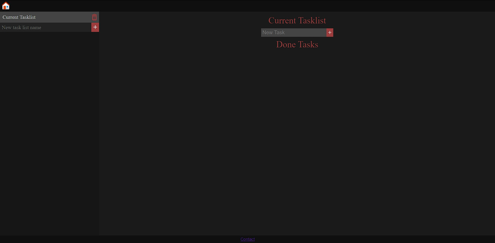

# Task manager

Projekt zaliczeniowy na przedmiot Tworzenie nowoczesnych aplikacji frontendowych 2023/2024.

[Live Preview](https://hphph.github.io/task-manager)



## Opis
Apka służy do zarządzenia wieloma to-do listami. Wykorzystane technologie to React, Typescript oraz React Router. Typescript ułatwił pracę z wieloma abstrakcyjnymi obiektami. React Router pozwolił na dodanie podstrony z formularzem kontaktowym z walidacją. Strona jest interaktywna, w pełni ostylowana i responsywna, można z niej korzystać zarówno na komputrze jak i na urządzeniu mobilnym. Do stylownia wykorzystany jest Grid i Flex.

## Instalacja
Aby zainstalować aplikację należy sklonować repo, a następnie zainstalować zależności.
```
git clone https://github.com/hphph/task-manager.git
cd task-manager
npm install
```

Następnie trzeba uruchomić serwer z aplikacją.
```
npm run dev
```
W terminalu pojawi się adres ip wraz z portem na którym serwer wystartował.